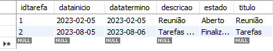

# Tarefa-Spring 

Primeiro começamos subindo o container do MYSQL para assim conseguirmos ligar a máquina virtual para ativarmos o Fedora com o comando "docker start".
#

# Ferramentas utilizadas
Mysql Workbench, Fedora, Docker, Eclipse, Spring-Boot Jenkins e Postman
#

# Passo a passo para realização das atividades

## INSTALAÇÃO/CONFIGUARAÇÃO DO OPENJDK e JAVA-17 

Começamos com a instalação do JAVA-17 utilizamos os comandos:
> sudo dnf install java-17-openjdk-devel
##
> sudo nano /etc/profile
##
>sudo nano /etc/profile
##
>export JAVA_HOME=/usr/lib/jvm/java-17-openjdk.
##
>source ~/.bashrc /pre>
##
>echo $JAVA_HOME

Para verificarmos se deu certo, utilizamos o comando:
>java --version
#

## INSTAÇÃO/ CONFIGURAÇÃO DO MAVEN

Para a instalação do MAVEN utilizamos os comandos:

>sudo dnf install maven
##
>sudo nano ~/.bashrc
##
>export MAVEN_HOME=/usr/share/maven
##
>source ~/.bashrc 
##
>echo $MAVEN_HOME

Para verificarmos se deu certo, utilizamos o comando:
>mvn --version
#

## INSTALAÇÃO/ CONFIGURAÇÃO DO JENKINS

Para a instalação do Jenkins utilizamos os comandos:

>sudo wget -O /etc/yum.repos.d/jenkins.repo \https://pkg.jenkins.io/redhat-stable/jenkins.repo
##
>sudo rpm --import https://pkg.jenkins.io/redhat-stable/jenkins.io-2023.key
#

## CONFIGURAÇÃO NO DOCKER
Após a instalação abriremos nosso cockpit para facilitar (mas não é obrigatório) e daremos alguns comandos como:
>sudo dnf upgrade
##
>sudo dnf install java-11-openjdk
##
>sudo dnf install jenkins
##
>sudo systemctl daemon-reaload

#
## CONFIGURAÇÃO NO JENKINS
Entramos no site do Jenkins com o link "http://127.0.0.1:8080" e precisamos fazer as configurações iniciais de usuário e também precisamos adicionar o Maven ao Jenkins dessa forma:
>Painel de controle > Gerenciar jenkins > Ferramenta de configuração global > Maven > Adicionar Maven.
##
E para acessar o site com o link nós direcionamos a porta na máquina virtual.
#

## REALIZAÇÃO DA ATIVIDADE
A atividade tinha como função cadastrar, atualizar e deletar. Então fizemos da seguinte forma:
##
Utilizamos o MYSQL criamos alguns campos como: idtarefa, título, descrição, data início, data término e estado(aberto e finalizado).

#
Utilizamos o Eclipse e instalamos o Spring-Boot e no Spring-Boot criamos camadas (DOMAIN, REPOSITORY e CONTROLLER) fizemos os códigos para cadastrar, atualizar e deletar as informações.

#
Utilizamos o Postman para testarmos se o projeto estava cadastrando, atualizando e deletando de forma correta.

#
Esse é o link onde podemos acessar os códigos que eu utilizei para realizar os trabalhos no Eclipse/Spring-Boot: https://github.com/TaynaGalbiate/projeto-atividade/tree/main/src/main/java/br/com/pro
#
Na máquina virtual nós direcionamos todos os caminhos para conseguirmos acessar os links

#
